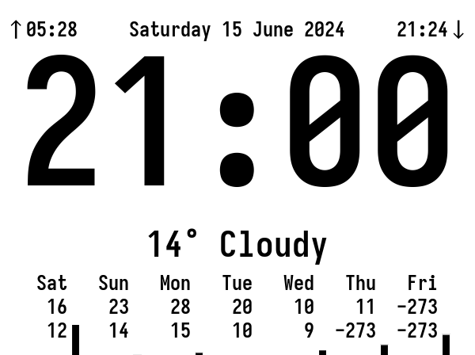

eink-weather
============

This is a simple combination of a bash and python script to show:

- time
- date
- sunrise/sunset times
- current weather
- temperature and rain for the next 7 days

on a [waveshare 5.83 inch (648×480 pixels) eink
display](https://www.waveshare.com/5.83inch-e-paper.htm). The scripts assume
the screen is this size and will need modifications for other sizes. The colors
are inverted (dark background) when the sun is down, and red is used instead of
black for all colors when it's warmer.

The python script is based on waveshare's own examples for displaying images on
the screen. The bash script generates a new image every n minutes using
imagemagick and displays it using the python script. The weather is fetched
from [pirateweather](https://pirateweather.net) and requires an API token.

